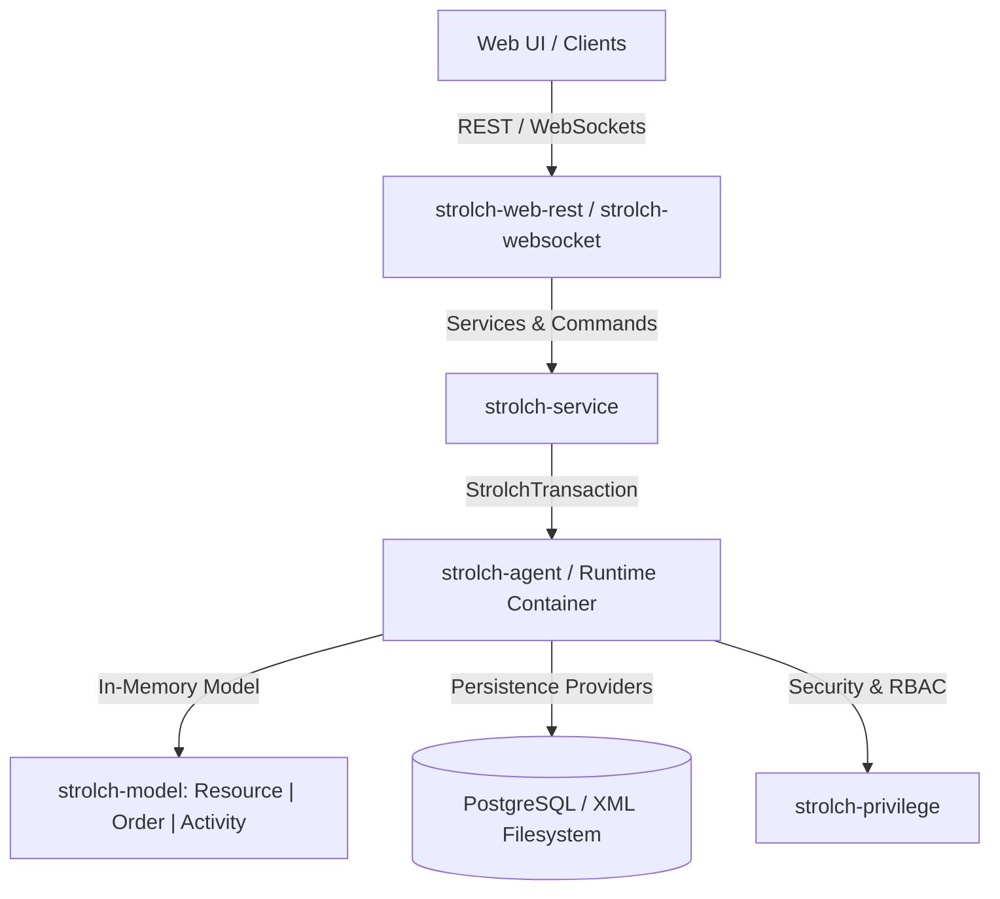

# Strolch

[](https://central.sonatype.com/namespace/li.strolch)
[](https://github.com/strolch-li/strolch/blob/master/LICENSE)
[](https://openjdk.org/)
[](https://github.com/strolch-li/strolch/graphs/contributors)
[](https://github.com/strolch-li/strolch/commits/develop)
[](https://github.com/strolch-li/strolch/network/members)
[](https://github.com/strolch-li/strolch/stargazers)
[](https://github.com/strolch-li/strolch/issues)

**Strolch** is an enterprise-grade, high-performance Java runtime and application framework based on a **Resource-Order-Activity (ROA)** domain model. It features an in-memory transactional object store, fine-grained Role-Based Access Control (RBAC), multi-tenant realm isolation, flexible persistence providers, and comprehensive REST and WebSocket interfaces.

Learn more at our website: [https://strolch.li](https://strolch.li)

---

## Table of Contents

- [Core Highlights](#core-highlights)
- [Architecture & Domain Model](#architecture--domain-model)
  - [Resource-Order-Activity (ROA) Paradigm](#resource-order-activity-roa-paradigm)
  - [Parameter Bags & Dynamic Schema](#parameter-bags--dynamic-schema)
  - [Timed States & Historical Values](#timed-states--historical-values)
  - [Policy-Driven Extensibility](#policy-driven-extensibility)
- [Module Overview](#module-overview)
- [Quick Start](#quick-start)
  - [Prerequisites](#prerequisites)
  - [Maven Dependency Management (BOM)](#maven-dependency-management-bom)
  - [Building from Source](#building-from-source)
- [Key Features & Code Examples](#key-features--code-examples)
  - [Fluent Model Construction](#fluent-model-construction)
  - [Transactional Data Access](#transactional-data-access)
  - [Services & Atomic Commands](#services--atomic-commands)
  - [Fluent Searches & SOQL](#fluent-searches--soql)
  - [Security & Personal Access Tokens (PATs)](#security--personal-access-tokens-pats)
  - [RESTful & WebSocket APIs](#restful--websocket-apis)
  - [Runtime Configuration & Maintenance](#runtime-configuration--maintenance)
- [Documentation Index](#documentation-index)
- [Community & License](#community--license)

---

## Core Highlights

- ⚡ **In-Memory Speed & Safety**: Instantaneous lookups and queries with robust concurrency locking (`readLock`, `writeLock`) and ACID transaction semantics.
- 🧩 **Flexible Schema Evolution**: Model complex domain objects dynamically using typed `ParameterBag` and `Parameter` containers without schema migrations.
- 🔒 **Fine-Grained RBAC & PATs**: Deep authorization down to individual operations and element locators, with session management and Personal Access Tokens.
- 🏢 **Multi-Tenancy & Realms**: Built-in support for multiple isolated data realms (transient, cached, or persistent).
- 🔄 **Executable Workflows**: Hierarchical activities and actions with resource allocation, state transitions, and time ordering.
- 🔍 **SOQL & Fluent Querying**: Powerful, type-safe search builders and Strolch Object Query Language (SOQL).
- 🌐 **Modern APIs**: Out-of-the-box Jakarta REST (Jersey with OpenAPI/Swagger) and WebSockets for real-time streaming updates.

---

## Architecture & Domain Model

Strolch's core architecture revolves around the **Resource-Order-Activity (ROA)** model:



### Resource-Order-Activity (ROA) Paradigm

1. **Resources (`Resource`)**: Represent master data, static entities, physical assets, or domain actors (e.g., *Product*, *Machine*, *Location*, *User*).
2. **Orders (`Order`)**: Represent transactional records, work orders, tasks, or business events moving through a defined lifecycle state (`Created`, `Planning`, `Planned`, `Executing`, `Executed`, `Closed`).
3. **Activities (`Activity`)**: Represent executable, hierarchical workflows and multi-step plans containing child activities and `Action`s with time-ordering constraints (`Series` or `Parallel`).

### Parameter Bags & Dynamic Schema

All root elements (`Resource`, `Order`, `Activity`) and `Action` elements implement `ParameterBagContainer`. Parameters are grouped inside named `ParameterBag` collections:

- **Supported Types**: `String`, `Integer`, `Double`, `Float`, `Long`, `Boolean`, `Date`, `Duration`, `Text`, `StringList`, `IntegerList`, `FloatList`, `LongList`.
- **Relationships**: Defined in a special `relations` bag with metadata (`Interpretation="Resource-Ref"`, `Uom="TargetType"`), supporting 1-to-1 (`String`) and 1-to-N (`StringList`) relations.

### Timed States & Historical Values

`Resource` elements can manage timed state variables (`StrolchTimedState`) that capture value changes, schedules, or measurements over time (e.g., stock levels, availability, temperature curves).

### Policy-Driven Extensibility

Algorithms, business rules, and integration handlers can be implemented as `StrolchPolicy` classes and dynamically resolved at runtime via configuration.

---

## Module Overview

| Module | Description | Documentation |
| :--- | :--- | :--- |
| **`strolch-bom`** | Bill of Materials (BOM) for managing dependencies across Strolch projects. | [README](strolch-bom/README.md) |
| **`strolch-model`** | Core domain model (ROA, Parameters, Bags, TimedStates, Visitors, Builders, XML/JSON). | [README](strolch-model/README.md) \| [Spec](strolch-model/docs/strolch-model.md) |
| **`strolch-agent`** | Core runtime container, component lifecycle, multi-tenant realms, transactions, and jobs. | [README](strolch-agent/README.md) \| [Runtime](strolch-agent/docs/runtime.md) |
| **`strolch-privilege`** | Fine-grained Role-Based Access Control (RBAC), authentication, and token management. | [README](strolch-privilege/README.md) \| [Spec](strolch-privilege/docs/technical-spec.md) |
| **`strolch-service`** | Service orchestration layer (`AbstractService`, `Command`, activity execution, migrations). | [README](strolch-service/README.md) \| [Services](strolch-service/docs/services.md) |
| **`strolch-soql`** | Strolch Object Query Language parser and AST execution engine using ANTLR4. | [README](strolch-soql/README.md) |
| **`strolch-utils`** | Project-independent Java utilities (Design-by-Contract, I18n, collections, date-time). | [README](strolch-utils/README.md) \| [Spec](strolch-utils/docs/strolch-utils.md) |
| **`strolch-persistence-postgresql`** | High-performance PostgreSQL persistence backend (XML/JSON storage, HikariCP pooling). | [README](strolch-persistence-postgresql/README.md) \| [Spec](strolch-persistence-postgresql/docs/technical-spec.md) |
| **`strolch-persistence-xml`** | Filesystem XML persistence provider for development and file-backed models. | [README](strolch-persistence-xml/README.md) \| [Spec](strolch-persistence-xml/docs/technical-spec.md) |
| **`strolch-xmlpers`** | Low-level filesystem XML object persistence engine. | [README](strolch-xmlpers/README.md) |
| **`strolch-web-rest`** | Jakarta REST (Jersey) API module with OpenAPI/Swagger support and auth filters. | [README](strolch-web-rest/README.md) \| [Endpoints](strolch-web-rest/docs/resources.md) |
| **`strolch-websocket`** | Real-time WebSocket event broadcaster and subscriptions for model mutations. | [README](strolch-websocket/README.md) \| [Spec](strolch-websocket/docs/strolch-websocket.md) |
| **`strolch-test-base`** | Test harness, `RuntimeMock`, test fixtures, and abstract test bases for JUnit. | [README](strolch-test-base/README.md) |
| **`strolch-jmh-benchmark`** | JMH micro-benchmark suite for performance testing. | [README](strolch-jmh-benchmark/README.md) |

---

## Quick Start

### Prerequisites

- **Java**: JDK 24 or higher recommended
- **Maven**: Version 3.6+

### Maven Dependency Management (BOM)

Import `strolch-bom` in your project's `pom.xml` to align all module versions:

```xml
<dependencyManagement>
    <dependencies>
        <dependency>
            <groupId>li.strolch</groupId>
            <artifactId>strolch-bom</artifactId>
            <version>2.7.0-SNAPSHOT</version>
            <type>pom</type>
            <scope>import</scope>
        </dependency>
    </dependencies>
</dependencyManagement>
```

Add the core dependencies to your application:

```xml
<dependencies>
    <dependency>
        <groupId>li.strolch</groupId>
        <artifactId>strolch-agent</artifactId>
    </dependency>
    <dependency>
        <groupId>li.strolch</groupId>
        <artifactId>strolch-service</artifactId>
    </dependency>
    <dependency>
        <groupId>li.strolch</groupId>
        <artifactId>strolch-web-rest</artifactId>
    </dependency>
</dependencies>
```

### Building from Source

Clone the repository and build with Maven:

```bash
git clone https://github.com/strolch-li/strolch.git
cd strolch
mvn clean install -DskipTests
```

To run full tests:

```bash
mvn clean install
```

---

## Key Features & Code Examples

### Fluent Model Construction

Construct Strolch elements fluently using builders:

```java
Resource product = new ResourceBuilder("prod-001", "Precision Sensor", "Product")
    .bag("parameters", "Parameters")
        .string("sku", "SKU").value("SEN-8821").end()
        .integer("stock", "Stock Level").value(42).end()
        .booleanParam("active", "Is Active").value(true).end()
    .endBag()
    .resourceRelation("manufacturer", "Manufacturer")
    .build();

// Convenient parameter access
String sku = product.getString("sku");
int stock = product.getInteger("stock");
```

### Transactional Data Access

Interact with the data model using safe, auditable transactions:

```java
try (StrolchTransaction tx = agent.openTx(cert, "UpdateProduct", false).rollbackOnFailure()) {
    // Acquire a read-locked modifiable copy
    Resource product = tx.getResourceBy("Product", "prod-001", true);
    Resource lockedProduct = tx.readLock(product);
    
    lockedProduct.setInteger("stock", 50);
    tx.update(lockedProduct);
    
    tx.commitOnClose();
}
```

### Services & Atomic Commands

Encapsulate business logic into reusable `AbstractService` and `Command` units:

```java
public class UpdateStockService extends AbstractService<StockArgument, ServiceResult> {
    @Override
    protected ServiceResult internalDoService(StockArgument arg) throws Exception {
        try (StrolchTransaction tx = openArgOrUserTx(arg)) {
            Resource product = tx.getResourceBy("Product", arg.productId, true);
            
            // Execute atomic command within transaction
            UpdateStockCommand command = new UpdateStockCommand(tx, product, arg.newQuantity);
            tx.doCommand(command);
            
            tx.commitOnClose();
        }
        return ServiceResult.success();
    }
}
```

### Fluent Searches & SOQL

Query the in-memory object model with type-safe predicates or SOQL queries:

```java
// Fluent Search API
List<Resource> activeSensors = new ResourceSearch()
    .types("Product")
    .where(param("parameters", "active", isEqualTo(true))
        .and(param("parameters", "stock", isGreaterThan(0))))
    .search(tx)
    .toList();

// Strolch Object Query Language (SOQL)
List<Resource> results = tx.doQuery(
    "SELECT r FROM Resource:Product r WHERE r.parameters.active = true");
```

### Security & Personal Access Tokens (PATs)

Strolch provides role-based authentication and long-lived Personal Access Tokens (PATs) for machine-to-machine integration:

```java
// Authenticate using a Personal Access Token
PrivilegeHandler privilegeHandler = agent.getContainer().getPrivilegeHandler();
Certificate cert = privilegeHandler.authenticatePersonalAccessToken(userPatToken);

// Validate permissions on element locators
tx.assertHasPrivilege(Operation.UPDATE, productResource);
```

For more details, see [Personal Access Tokens Guide](strolch-privilege/docs/PersonalAccessToken.md).

### RESTful & WebSocket APIs

- **REST API**: Standard endpoints for model CRUD operations, inspections, queries, and service triggers using Jakarta REST and OpenAPI annotations. See [REST Documentation](strolch-web-rest/README.md).
- **WebSocket API**: Push live updates to frontend clients when elements change. See [WebSocket Documentation](strolch-websocket/README.md).

### Runtime Configuration & Maintenance

- **Dynamic Configuration**: Inspect and update runtime policies on the fly without service restarts. See [Runtime Configuration Management](docs/RuntimeConfigurationManagement.md).
- **Automated Temp File Retention**: Built-in scheduled cleanup of temporary files based on configurable ISO-8601 durations. See [Temporary File Retention](docs/TemporaryFileRetention.md).
- **Operations Log**: Centralized, queryable system event and alert stream with I18n localization. See [Operations Log Guide](strolch-agent/docs/operationslog.md).

---

## Documentation Index

Explore detailed documentation across all Strolch domains:

### Architecture & Runtime
- [Strolch Agent & Runtime Guide](strolch-agent/docs/runtime.md)
- [Transaction API & Concurrency](strolch-agent/docs/transactions.md)
- [Realms & Multi-Tenancy](strolch-agent/docs/realms.md)
- [Policy Extensibility Pattern](strolch-agent/docs/policies.md)
- [Job Handler & Background Tasks](strolch-agent/docs/jobs.md)
- [Runtime Configuration Management](docs/RuntimeConfigurationManagement.md)
- [Temporary File Retention](docs/TemporaryFileRetention.md)

### Domain Model & Utilities
- [Strolch Model Technical Specification](strolch-model/docs/strolch-model.md)
- [Parameter Memory Footprint Baseline](strolch-model/docs/parameter-memory-footprint-baseline.md)
- [Strolch Utils Guide](strolch-utils/docs/strolch-utils.md)
- [Enum Handler](strolch-agent/docs/enums.md)

### Security & Auditing
- [Privilege & RBAC Architecture](strolch-privilege/docs/technical-spec.md)
- [Personal Access Tokens (PATs)](strolch-privilege/docs/PersonalAccessToken.md)
- [Sessions & Privilege Handling](strolch-agent/docs/sessions.md)
- [Audit Trail Handler](strolch-agent/docs/audits.md)
- [Operations Log](strolch-agent/docs/operationslog.md)

### Logic, Execution & Querying
- [Service & Command Architecture](strolch-service/docs/services.md)
- [Activity Execution Framework](strolch-service/docs/execution.md)
- [Reporting Framework](strolch-service/docs/reporting.md)
- [Migration Framework](strolch-service/docs/migrations.md)
- [Search API](strolch-agent/docs/search.md)
- [SOQL Guide](strolch-soql/README.md)

### Persistence & Web APIs
- [PostgreSQL Persistence Specification](strolch-persistence-postgresql/docs/technical-spec.md)
- [XML Persistence Specification](strolch-persistence-xml/docs/technical-spec.md)
- [REST API Endpoints & Authentication](strolch-web-rest/docs/resources.md)
- [WebSocket API Specification](strolch-websocket/docs/strolch-websocket.md)

---

## Community & License

- **Website**: [https://strolch.li](https://strolch.li)
- **Source Code**: [GitHub Repository](https://github.com/strolch-li/strolch)
- **Issues**: [GitHub Issue Tracker](https://github.com/strolch-li/strolch/issues)
- **Code of Conduct**: [CODE_OF_CONDUCT.md](CODE_OF_CONDUCT.md)
- **Security Policy**: [SECURITY.md](SECURITY.md)
- **License**: Strolch is licensed under the [Apache License, Version 2.0](LICENSE).
