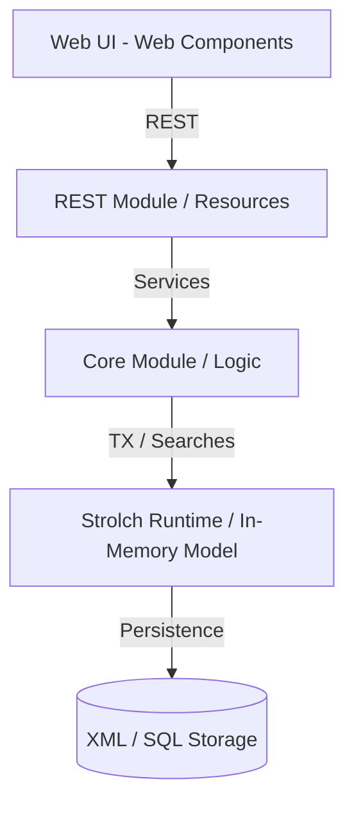

# Generic Strolch Specification

### Overview & Goals
This specification outlines the standard architecture and implementation patterns for projects built on the **Strolch** framework. Strolch is a Resource-Order-Activity based runtime designed for high-performance, in-memory domain modeling and transaction management.

### Architecture
A typical Strolch project is organized as a multi-module Maven project to ensure clear separation of concerns.

#### Module Breakdown
1.  **`<ProjectName>-core`**:
    - **Domain Model**: Contains Strolch Resource and Order templates (defined in XML).
    - **Business Logic**: Encapsulated in **Services** (entry points) and **Commands** (atomic operations).
    - **Data Retrieval**: Implemented using **Searches** for fluent querying.
    - **Policies**: Extensible logic defined via the Strolch Policy pattern.
    - **Persistence**: Handles data state via Strolch's in-memory model with persistence providers (XML, JSON, or PostgreSQL).
2.  **`<ProjectName>-web`**:
    - **Bootstrap**: Contains the `StartupListener` (ServletContextListener) that initializes the `StrolchAgent`.
    - **REST API**: Implements the public interface using Jakarta REST (Jersey). The `RestfulApplication` registers resources and Strolch-specific filters (Auth, Logging, etc.).
    - **Frontend**: Deployment unit for web assets (typically Lit/Web Components and `strolchjs`).
    - **Packaging**: Usually a WAR file for deployment in a servlet container (e.g., Tomcat).

### Data Model (Strolch XML)
The domain is modeled using three primary elements:
- **Resources**: Represent static or master data (e.g., Users, Products, Locations).
- **Orders**: Represent transactional or process-oriented data (e.g., Tasks, Bookings, Orders).
- **Activities**: Represent complex workflows or hierarchical execution plans.

#### XML Structure Example
Strolch elements are defined in XML files (typically `templates.xml` or `Model.xml`) using the following structure:

```xml
<StrolchModel xmlns="https://strolch.li/schema/StrolchModel.xsd">
    <Resource Id="myResourceId" Name="My Resource Name" Type="MyResourceType">
        <!-- Parameters are grouped in bags -->
        <ParameterBag Id="parameters" Name="Parameters" Type="Parameters">
            <Parameter Id="color" Name="Color" Type="String" Value="Red"/>
            <Parameter Id="weight" Name="Weight" Type="Integer" Value="10"/>
            <Parameter Id="active" Name="Active" Type="Boolean" Value="true"/>
        </ParameterBag>
        
        <!-- Relationships are defined in a special bag with ID 'relations' -->
        <ParameterBag Id="relations" Name="Relations" Type="Relations">
             <!-- Use Interpretation and Uom attributes for metadata -->
            <Parameter Id="parent" Name="Parent" Type="String" 
                       Interpretation="Resource-Ref" Uom="MyResourceType" Value=""/>
        </ParameterBag>
    </Resource>
</StrolchModel>
```

Elements are further detailed using **ParameterBags** and **Parameters** (String, Integer, Double, Boolean, Date, Float, StringList, etc.).

Note: All attribute names e.g. `Id`, `Name`, `Interpretation`, `Uom`, etc. are **case-sensitive** and must be capitalized as shown.

### Key Design Patterns
- **Service Pattern**: All business operations must be wrapped in an `AbstractService`. Services manage the lifecycle of a `StrolchTransaction` (TX).
- **Command Pattern**: Reusable atomic changes within a TX are implemented as `Command` classes.
- **Search Pattern**: Complex queries are implemented by extending `ResourceSearch`, `OrderSearch`, or `ActivitySearch`.
- **Policy Pattern**: Algorithms that may vary by type or customer are implemented as `StrolchPolicy` and configured in `StrolchPolicies.xml`.

### Component Diagram


### Deployment Structure
A Strolch application expects a `runtime/` directory structure:
- `runtime/config/`: Configuration files (`StrolchConfiguration.xml`, `PrivilegeConfig.xml`, `StrolchPolicies.xml`).
- `runtime/data/`: Initial and persisted data (`Model.xml`, `templates.xml`).
- `runtime/temp/`: Temporary files and logs.


# Delivery Steps

###   Step 1: Project Structure & Parent POM Setup
Initialize the parent POM and sub-module structure following the Strolch project pattern.
- Update `MyStrolchProject/pom.xml` to `packaging: pom`.
- Set `jdk.version` property to 24 (or latest supported).
- Define `MyStrolchProject-core` and `MyStrolchProject-web` modules.
- Add `strolch-bom` to `dependencyManagement` for version alignment.

###   Step 2: Core Module & Domain Logic Implementation
Implement the domain model and business logic in the core module.
- Create `MyStrolchProject-core` module.
- Define Strolch templates for Resources and Orders in `runtime/data/templates.xml`.
- Implement business logic through Strolch Services and Commands in `ch.example.core.service`.
- Implement custom data retrieval logic using Strolch Searches in `ch.example.core.search`.
- Add core configuration files (e.g., `StrolchPolicies.xml`) in `runtime/config`.

###   Step 3: Web Module & REST API Implementation
Implement the web entry point and RESTful API.
- Create `MyStrolchProject-web` module with `war` packaging.
- Implement `StartupListener` to bootstrap the `StrolchAgent`.
- Implement `RestfulApplication` to configure Jersey and register REST resources.
- Create REST resources in `ch.example.rest` to expose core services.
- Set up the frontend structure in `src/main/webapp` using modern web technologies.